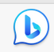
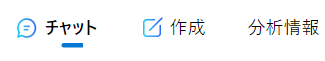

# Bing AIツールチュートリアル

## Bing AIツールの始め方

Edgeを起動し、右上のbマークをクリックするとサイドバーが開きます。アカウントの入力を求められたら、情報を入力してログインしましょう。

https://www.microsoft.com/ja-jp/edge/features/bing-chat?form=MT00D8

## 3つの機能

①チャット

Chat-GPT同様にチャット形式で対話ができます。Microsoft製品に関する質問が特に有効です

②作成

文章のトーン、形式、長さを選択でき、文章の作成に特化した機能です

③分析情報

ブラウザに表示しているページのポイントを要約したり、関連記事を表示したりできます。

# さあ、はじめてみましょう！
