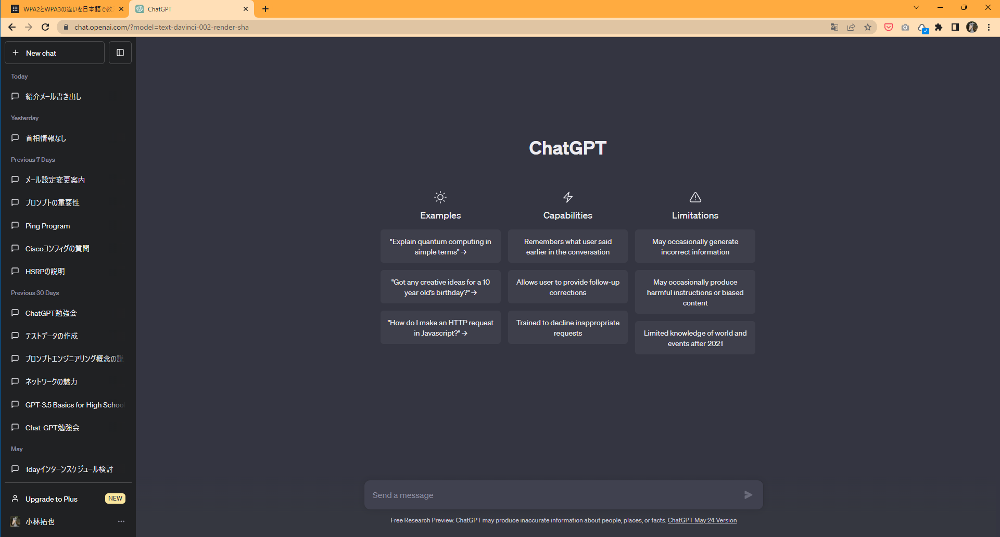
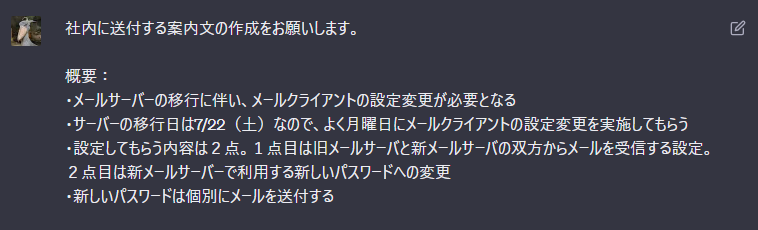
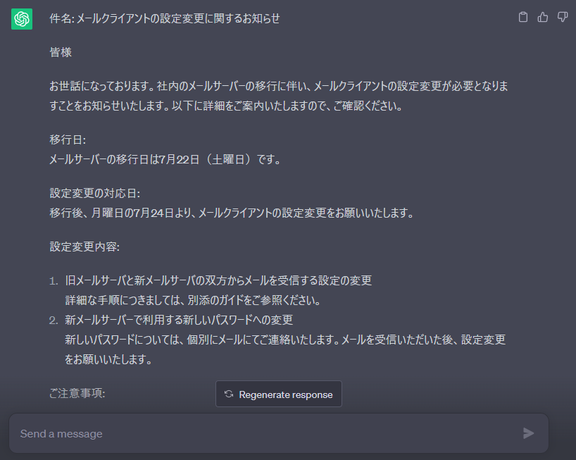

# Chat-GPTチュートリアル

## Chat-GPTの始め方
https://openai.com/chatgpt

[アカウント作成の手順(PDF)](chat-gpt_startup.pdf)

アカウント作成の手順（外部サイト）
https://prebell.so-net.ne.jp/tips/pre_23061601.html

# 具体例
**画面全体**

①画面したのボックスにプロンプトを入力する

③例えば先日アナウンスしたメール移行のお知らせ

※右上の鉛筆マークを押すと、質問を再編集できます

③Chat-GPTからの回答

Regenerate responseをクリックすると、回答が再生成されますが、
再生成前の回答も残ります。

# プロンプトに関するTIPS
## 思ったような回答が出力されない時の見直しポイント

READMEにも記載した通り、以下の見直しが必要です
- 命令・指示が具体的であるか
- 文脈（コンテキスト）が適切であるか
- 入力情報が適切であるか
- 出力結果のフォーマットや型式が期待通りであるか

## プロンプト例
プロンプト例のコンテンツを用意しようと思っていたところ、すでに文例集のサイトが立ち上がってました。
すごい

https://prompt.quel.jp/

# さあ、はじめてみましょう！
