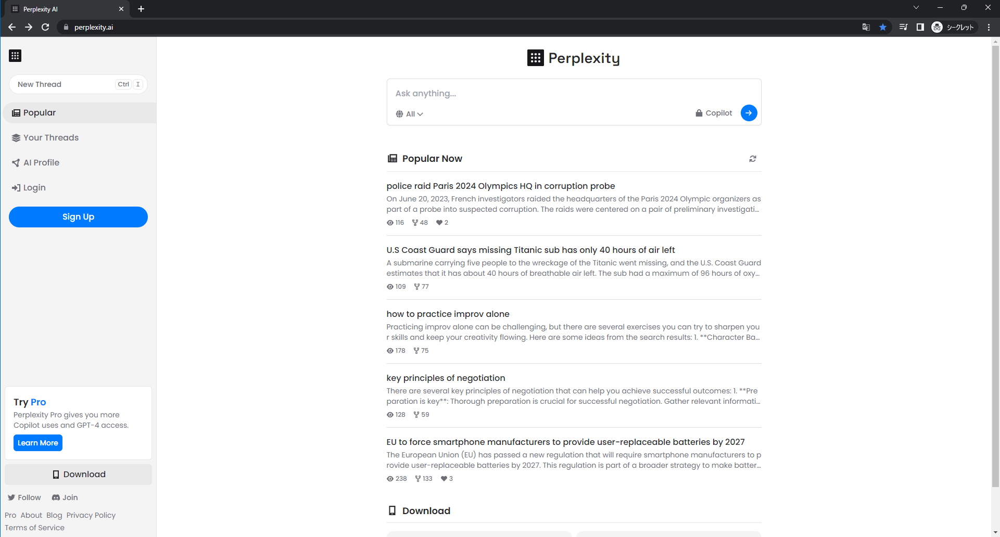
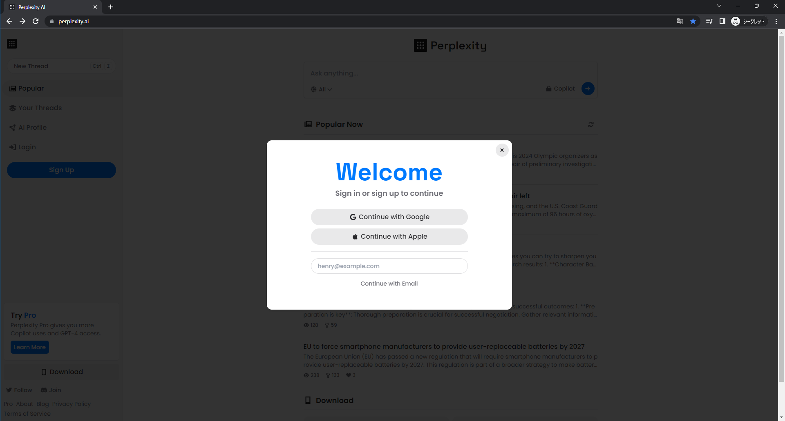
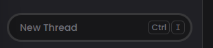
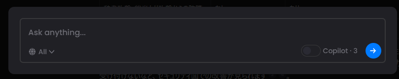
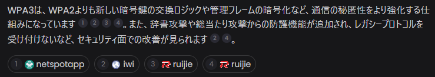
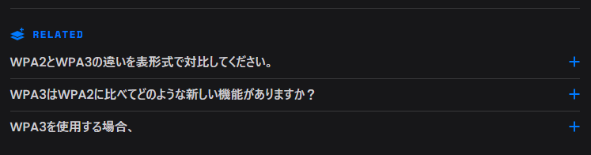

## Perplexityチュートリアル

### Perplexityの始め方
https://www.perplexity.ai/

Perplexityは、サインアップしなくても利用できます。
ですが、履歴の管理やcopilot機能はサインアップしないと利用できないため、サインアップ推奨です。
Googleアカウントで登録できるので、登録しましょう。

①画面左の**Sign Up**ボタンをクリック

②**Conginue with Google**ボタンをクリックし、アカウントを紐づける
もちろんAppleアカウントでも可能です

# 具体例

質問文：
WPA2とWPA3の違いを日本語で教えてください。可能であれば表形式での対比もお願いします。

[出力結果](https://www.perplexity.ai/search/14fda64e-e3f3-4963-aa1e-27614854e624?s=c)

# 画面説明

①プロンプトを書き込む場所。画面左です

②New Threadを選択すると画面中央に入力箇所がクローズアップされます

③Perplexityが出力した情報の元リンクです
文中の数字が情報元にリンクしています

④質問内容や出力結果に関連する質問がRELATEDに表示されます

⑤画面右上の**Share**ボタンからThreadの共有ができます

# さあ、はじめてみましょう！
